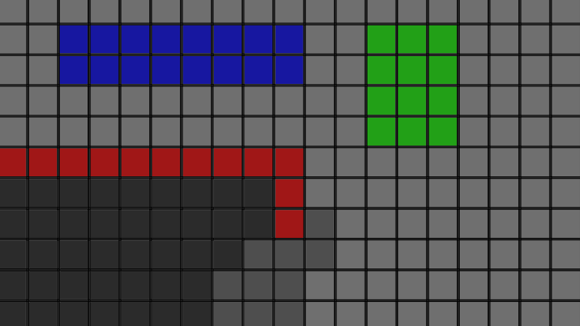
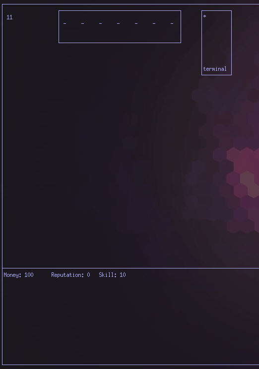
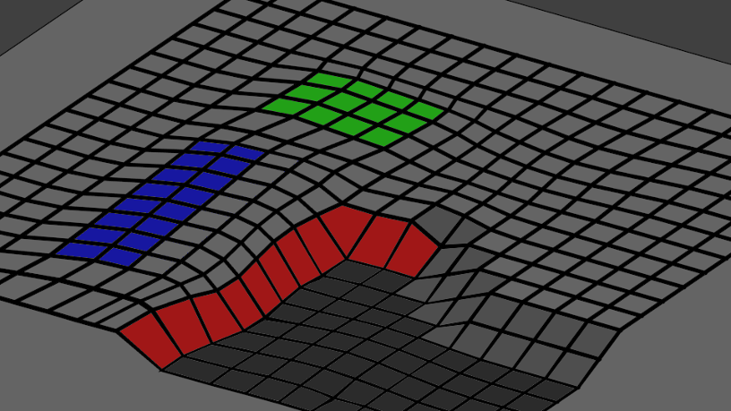

# AirportTycoon

Airport Tycoon is a very early stage game being developed in C, mainly as a way to practice modularization and various features in the language.

One important design decision is the complete seperation and black boxing of game logic and graphics handling. Allowing easy swapping of graphics engines.

A few example images show: 

The grid based layout exported by the game logic.

An example graphics dislay with minimal processing using ncurses (this is the mode development will take place in). 

An example of the same exported data which has had it's coordinates warped by a hypothetical graphics system.

A fully 3D environment can be populated with out changing any of the game logic.
